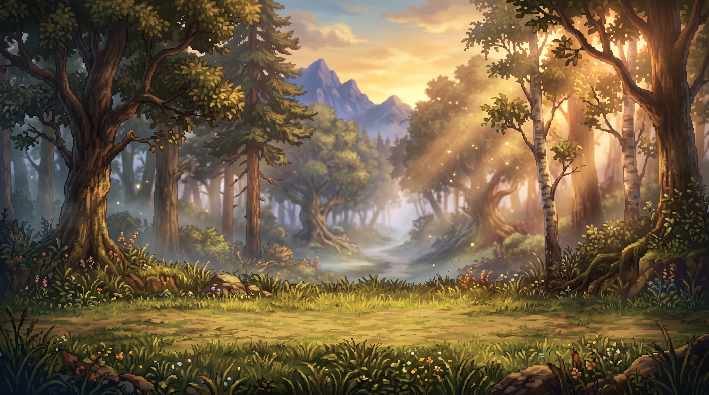

# Wanderers of Orsterra — an HD-2D (Octopath Traveler-style) vertical slice

A small but complete **Octopath Traveler-style** game built in **Godot 4.6**, with every
visual and audio asset generated through the **Meowa `game-assets`** skill.

It captures the core Octopath loop:

1. **Explore** an HD-2D field — real 3D world, billboarded pixel-art characters,
   depth-of-field camera, dynamic lighting.
2. **Talk** to NPCs, read signposts, open a chest.
3. **Step into the tall brush** to trigger a random encounter (Octopath's shatter-flash transition).
4. **Fight** a turn-based battle built around the two systems that define Octopath:
   **Break** and **Boost**.



## How to run

```bash
godot --path .                 # opens the project (Title screen is the main scene)
# or open project.godot in the Godot 4.6 editor and press Play
```

> The project uses the **Forward+** renderer for the HD-2D depth-of-field, glow and
> 3D lighting. It runs on software Vulkan (lavapipe) too, just slowly.

## Controls

| Action | Keys |
|---|---|
| Move | **WASD** / **Arrow keys** |
| Interact / Confirm | **E** / **Enter** / **Space** |
| Cancel / Back | **Esc** / **X** |
| Battle: navigate menu | **Up / Down** |
| Battle: **adjust Boost** | **Left / Right** |
| Battle: choose target | **Left / Right** |

## The two signature systems

### ⚔ Break
Every enemy has a row of hidden **weaknesses** (weapon types `🗡 Sword / 🏹 Bow / ✚ Staff`
and elements `🔥 Fire / ❄ Ice / ✦ Light`) and a **shield count**. Hitting a weakness:
- reveals that weakness (shown as `?` until discovered), and
- removes one shield point.

When the shield hits 0 the enemy is **Broken**: it's stunned (loses its turn), takes
**heavy bonus damage** (×1.8), then recovers with a full shield. Multi-hit skills
(e.g. *Arrow Volley*, 3 hits) shred shields fast.

### ✦ Boost
Each unit banks **1 Boost Point per turn** (max 5). Before acting you may spend up
to **3 BP** to:
- add hits to multi-hit moves (more shield damage + more damage),
- amplify single hits and heals.

Spending boost skips that turn's BP gain — exactly like Octopath. The classic play is
to *save BP, wait for the Break, then unload a fully-boosted attack on the helpless foe*.

The party: **Aldric** (Warrior/sword), **Seraphine** (Sorcerer/fire & ice),
**Lumen** (Cleric/light & heal), **Rowan** (Hunter/bow).

## HD-2D rendering

`scripts/HD2D.gd` is the shared look:
- Characters are **`Sprite3D`** billboards (`BILLBOARD_FIXED_Y`, nearest-neighbour
  filtering, alpha prepass) standing on a real 3D ground plane.
- Soft **blob shadows** are projected with `Decal`s onto the ground.
- The camera uses **`CameraAttributesPractical`** depth-of-field for the tilt-shift /
  bokeh that sells the "miniature diorama" HD-2D feel.
- `WorldEnvironment` adds glow/bloom, filmic tonemapping, fog and colour grading.
- Battles place the painted backdrop as a large quad far behind the fighters so it
  catches the DoF blur, just like Octopath's battle scenes.

## Project layout

```
project.godot            Godot config (Forward+, autoloads, window)
scenes/
  Title.tscn             Title screen
  Field.tscn             Explorable HD-2D field
  Battle.tscn            Turn-based battle
scripts/
  GameData.gd  (autoload) Party, enemies, skills, weaknesses, input map
  Audio.gd     (autoload) BGM crossfade + SFX pool
  SceneManager.gd (autoload) Fades & encounter transition
  HD2D.gd                Billboard sprites, blob shadows, tiled ground
  Title.gd / Field.gd / Player.gd / Battle.gd
assets/
  sprites/               Final character + prop PNGs (transparent)
  textures/              Tileable ground + battle backdrop
  audio/                 Field & battle BGM (mp3)
  sfx/                   8 UI/combat sound effects (mp3)
  generated/             Raw Meowa output (kept for reference)
```

## Assets — generated with Meowa

All art and audio were produced via the `game-assets` skill (`meowart_api.py`):

| Asset | Meowa command / template |
|---|---|
| Hero, Mage, Cleric, Hunter, Wolf, Goblin, 2 villagers | `pixel-gen-run` · `large_3_4` (full-body HD-2D pixel sprites) |
| 8 trees, 8 field objects | `pixel-gen-run` · `树木` / `object` |
| Grass + path ground | `texture-gen-run` (tileable, four-way seamless) |
| Battle backdrop | `gemini-generate-content` (16:9 painterly concept) |
| Field & battle BGM | `music-run --audio-generate` |
| UI + combat SFX pack | `sound-run --sound-pack --count 8` |

Set your key once (already git-ignored) before regenerating:

```bash
echo 'MEOWART_API_KEY=ma_live_...' > .env
python3 .agents/skills/game-assets/meowart_api.py credits-balance
```

## Dev / verification hooks (inert during normal play)

Guarded by environment variables, used to test headlessly:
- `AUTO_BATTLE=1` — the party auto-plays the battle to completion.
- `AUTO_LOSE=1` — makes enemies unkillable to exercise the defeat path.
- `SHOT_OUT=/path.png SHOT_FRAMES=120` — render a scene offscreen and save a PNG.

Example:
```bash
AUTO_BATTLE=1 godot --headless res://scenes/Battle.tscn --quit-after 3000
```
